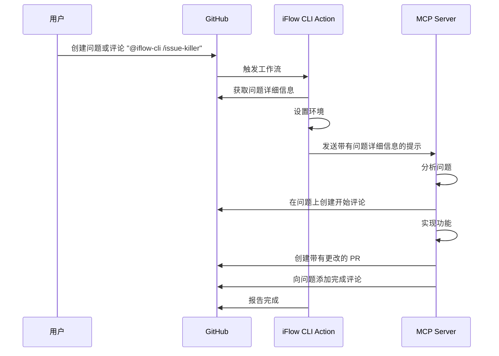
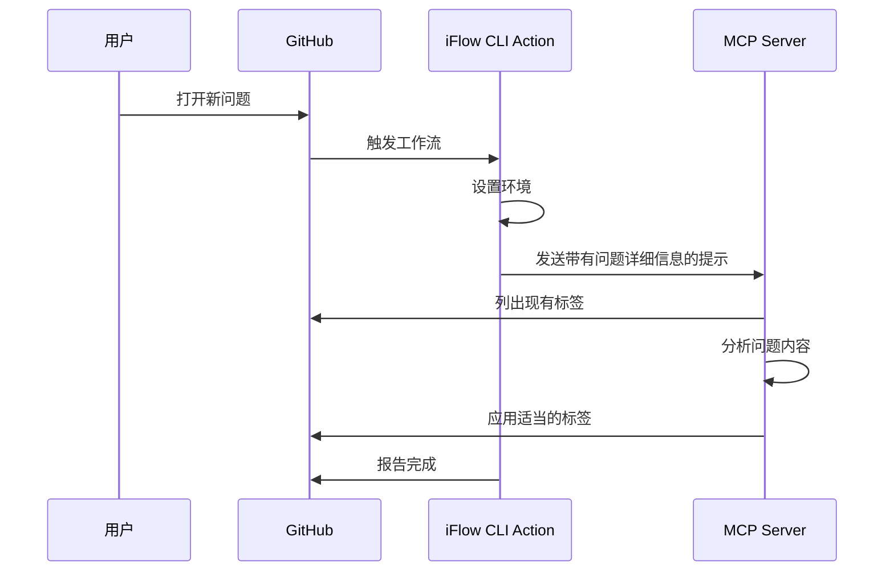
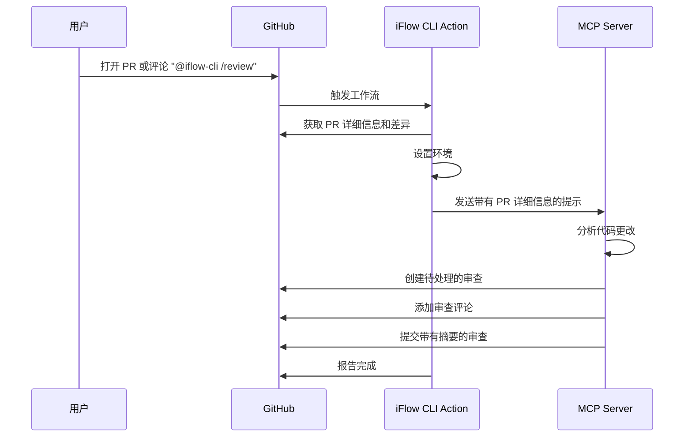
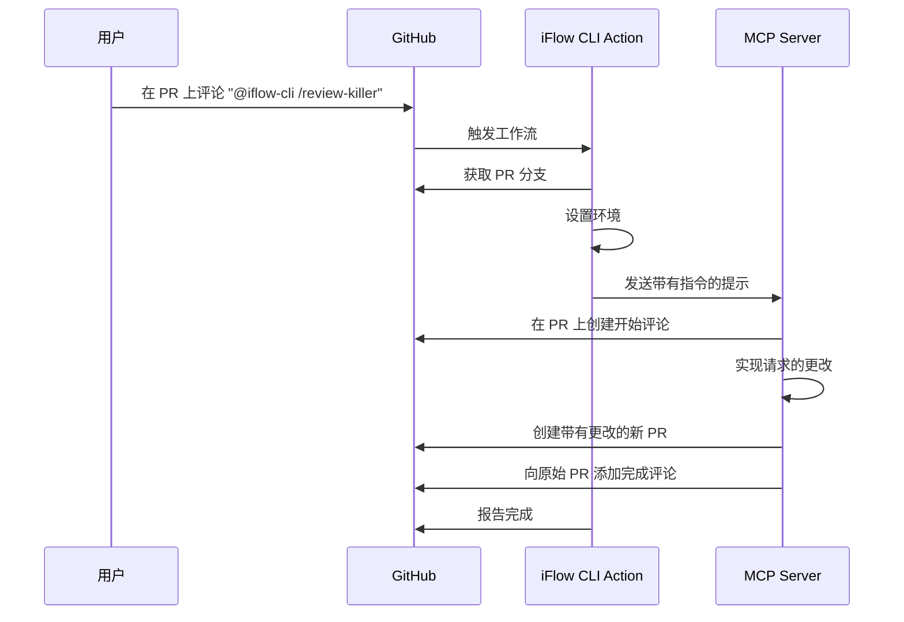

# 示例工作流

此目录包含示例 GitHub Actions 工作流，演示如何使用 iFlow CLI Action。

**注意：** 所有 iFlow CLI 命令都会自动使用 `--prompt` 和 `--yolo` 标志执行，以实现非交互式、简化的操作。

## 基本示例

### 在拉取请求上进行代码审查

```yaml
# .github/workflows/pr-review.yml
name: '🧐 iFLOW CLI 拉取请求审查'

on:
  pull_request:
    types:
      - 'opened'
      - 'reopened'
  issue_comment:
    types:
      - 'created'
  pull_request_review_comment:
    types:
      - 'created'
  pull_request_review:
    types:
      - 'submitted'
  workflow_dispatch:
    inputs:
      pr_number:
        description: '要审查的 PR 编号'
        required: true
        type: 'number'

concurrency:
  group: '${{ github.workflow }}-${{ github.head_ref || github.ref }}'
  cancel-in-progress: true

defaults:
  run:
    shell: 'bash'

permissions:
  contents: 'read'
  id-token: 'write'
  issues: 'write'
  pull-requests: 'write'
  statuses: 'write'

jobs:
  review-pr:
    # 此条件旨在确保操作仅由受信任的用户触发。
    # 对于私有仓库，有权访问仓库的用户被视为受信任的。
    # 对于公共仓库，成员、所有者或协作者被视为受信任的。
    if: |-
      github.event_name == 'workflow_dispatch' ||
      (
        github.event_name == 'pull_request' &&
        (
          github.event.repository.private == true ||
          contains(fromJSON('[\"OWNER\", \"MEMBER\", \"COLLABORATOR\"]'), github.event.pull_request.author_association)
        )
      ) ||
      (
        (
          (
            github.event_name == 'issue_comment' &&
            github.event.issue.pull_request
          ) ||
          github.event_name == 'pull_request_review_comment'
        ) &&
        (
          contains(github.event.comment.body, '@iflow-cli /review ') ||
          contains(github.event.comment.body, '@iFlow-CLI /review ') ||
          contains(github.event.comment.body, '@IFLOW-CLI /review ') ||
          contains(github.event.comment.body, '@IFlow-CLI /review ') ||
          endsWith(github.event.comment.body, '@iflow-cli /review') ||
          endsWith(github.event.comment.body, '@iFlow-CLI /review') ||
          endsWith(github.event.comment.body, '@IFLOW-CLI /review') ||
          endsWith(github.event.comment.body, '@IFlow-CLI /review')
        ) &&
        (
          github.event.repository.private == true ||
          contains(fromJSON('[\"OWNER\", \"MEMBER\", \"COLLABORATOR\"]'), github.event.comment.author_association)
        )
      ) ||
      (
        github.event_name == 'pull_request_review' &&
        (
          contains(github.event.review.body, '@iflow-cli /review ') ||
          contains(github.event.review.body, '@iFlow-CLI /review ') ||
          contains(github.event.review.body, '@IFLOW-CLI /review ') ||
          contains(github.event.review.body, '@IFlow-CLI /review ') ||
          endsWith(github.event.review.body, '@iflow-cli /review') ||
          endsWith(github.event.review.body, '@iFlow-CLI /review') ||
          endsWith(github.event.review.body, '@IFLOW-CLI /review') ||
          endsWith(github.event.review.body, '@IFlow-CLI /review')
        ) &&
        (
          github.event.repository.private == true ||
          contains(fromJSON('[\"OWNER\", \"MEMBER\", \"COLLABORATOR\"]'), github.event.review.author_association)
        )
      )
    timeout-minutes: 5
    runs-on: 'ubuntu-latest'
    steps:
      - name: '检出 PR 代码'
        uses: 'actions/checkout@11bd71901bbe5b1630ceea73d27597364c9af683' # ratchet:actions/checkout@v4

      - name: '获取 PR 详细信息 (pull_request & workflow_dispatch)'
        id: 'get_pr'
        if: |-
          ${{ github.event_name == 'pull_request' || github.event_name == 'workflow_dispatch' }}
        env:
          GITHUB_TOKEN: '${{ secrets.GITHUB_TOKEN }}'
          EVENT_NAME: '${{ github.event_name }}'
          WORKFLOW_PR_NUMBER: '${{ github.event.inputs.pr_number }}'
          PULL_REQUEST_NUMBER: '${{ github.event.pull_request.number }}'
        run: |-
          set -euo pipefail

          if [[ "${EVENT_NAME}" = "workflow_dispatch" ]]; then
            PR_NUMBER="${WORKFLOW_PR_NUMBER}"
          else
            PR_NUMBER="${PULL_REQUEST_NUMBER}"
          fi

          echo "pr_number=${PR_NUMBER}" >> "${GITHUB_OUTPUT}"

          # 获取 PR 详细信息
          PR_DATA="$(gh pr view "${PR_NUMBER}" --json title,body,additions,deletions,changedFiles,baseRefName,headRefName)"
          echo "pr_data=${PR_DATA}" >> "${GITHUB_OUTPUT}"

          # 获取文件更改
          CHANGED_FILES="$(gh pr diff "${PR_NUMBER}" --name-only)"
          {
            echo "changed_files<<EOF"
            echo "${CHANGED_FILES}"
            echo "EOF"
          } >> "${GITHUB_OUTPUT}"


      - name: '获取 PR 详细信息 (issue_comment & reviews)'
        id: 'get_pr_comment'
        if: |-
          ${{ github.event_name == 'issue_comment' || github.event_name == 'pull_request_review' || github.event_name == 'pull_request_review_comment' }}
        env:
          GITHUB_TOKEN: '${{ secrets.GITHUB_TOKEN }}'
          COMMENT_BODY: '${{ github.event.comment.body || github.event.review.body }}'
          PR_NUMBER: '${{ github.event.issue.number || github.event.pull_request.number }}'
        run: |-
          set -euo pipefail

          echo "pr_number=${PR_NUMBER}" >> "${GITHUB_OUTPUT}"

          # 从评论中提取附加指令（不区分大小写，精确匹配 /review）
          ADDITIONAL_INSTRUCTIONS=""
          if echo "${COMMENT_BODY}" | grep -qiE '@iflow-cli[[:space:]]+/review([[:space:]]|$)'; then
            ADDITIONAL_INSTRUCTIONS="$(echo "${COMMENT_BODY}" | sed -E 's/.*@[iI][fF][lL][oO][wW]-[cC][lL][iI][[:space:]]+\\/[rR][eE][vV][iI][eE][wW][[:space:]]*(.*)/\\1/' | sed 's/^[[:space:]]*//;s/[[:space:]]*$//')"
          fi
          echo "additional_instructions=${ADDITIONAL_INSTRUCTIONS}" >> "${GITHUB_OUTPUT}"

          # 获取 PR 详细信息
          PR_DATA="$(gh pr view "${PR_NUMBER}" --json title,body,additions,deletions,changedFiles,baseRefName,headRefName)"
          echo "pr_data=${PR_DATA}" >> "${GITHUB_OUTPUT}"

          # 获取文件更改
          CHANGED_FILES="$(gh pr diff "${PR_NUMBER}" --name-only)"
          {
            echo "changed_files<<EOF"
            echo "${CHANGED_FILES}"
            echo "EOF"
          } >> "${GITHUB_OUTPUT}"

      - name: '运行 iFLOW CLI PR 审查'
        uses: iflow-ai/iflow-cli-action@v1.3.0
        id: 'iflow_cli_pr_review'
        env:
          GITHUB_TOKEN: '${{ secrets.GITHUB_TOKEN }}'
          PR_NUMBER: '${{ steps.get_pr.outputs.pr_number || steps.get_pr_comment.outputs.pr_number }}'
          PR_DATA: '${{ steps.get_pr.outputs.pr_data || steps.get_pr_comment.outputs.pr_data }}'
          CHANGED_FILES: '${{ steps.get_pr.outputs.changed_files || steps.get_pr_comment.outputs.changed_files }}'
          ADDITIONAL_INSTRUCTIONS: '${{ steps.get_pr.outputs.additional_instructions || steps.get_pr_comment.outputs.additional_instructions }}'
          REPOSITORY: '${{ github.repository }}'
        with:
          api_key: ${{ secrets.IFLOW_API_KEY }}
          timeout: "3600"
          extra_args: "--debug"
          settings_json: |
            {
                "selectedAuthType": "iflow",
                "apiKey": "${{ secrets.IFLOW_API_KEY }}",
                "baseUrl": "https://apis.iflow.cn/v1",
                "modelName": "Qwen3-Coder",
                "searchApiKey": "${{ secrets.IFLOW_API_KEY }}",
                "mcpServers": {
                  "github": {
                  "command": "github-mcp-server",
                  "args": [
                    "stdio"
                  ],
                  "includeTools": [
                    "create_pending_pull_request_review",
                    "add_comment_to_pending_review",
                    "submit_pending_pull_request_review",
                    "list_pull_requests"
                  ],
                    "env": {
                      "GITHUB_PERSONAL_ACCESS_TOKEN": "${{ secrets.GITHUB_TOKEN }}"
                    }
                  }
                }
            }
          prompt: |
            ## 角色

            你是一位专业的代码审查员。你有权使用工具来收集 PR 信息并在 GitHub 上执行审查。请使用可用的工具来收集信息；不要要求提供信息。

            ## 要求
            1. 所有反馈必须留在 GitHub 上。
            2. 任何未在 GitHub 上留下的输出都将不会被看到。

            ## 步骤

            首先运行这些命令来收集所需数据：
            1. 运行: echo "${REPOSITORY}" 以获取以 <OWNER>/<REPO> 格式的 GitHub 仓库
            2. 运行: echo "${PR_DATA}" 以获取 PR 详细信息 (JSON 格式)
            3. 运行: echo "${CHANGED_FILES}" 以获取更改文件列表
            4. 运行: echo "${PR_NUMBER}" 以获取 PR 编号
            5. 运行: echo "${ADDITIONAL_INSTRUCTIONS}" 以查看用户提供的任何特定审查指令
            6. 运行: gh pr diff "${PR_NUMBER}" 以查看完整差异并参考上下文部分来理解它
            7. 对于任何特定文件，使用: cat filename, head -50 filename, 或 tail -50 filename
            8. 如果 ADDITIONAL_INSTRUCTIONS 包含文本，请优先审查这些特定区域或关注点。常见指令示例："关注安全性"、"检查性能"、"审查错误处理"、"检查破坏性更改"

            ## 指南
            ### 核心指南（始终适用）

            1. 理解上下文：分析拉取请求标题、描述、更改和代码文件以理解意图。
            2. 细致审查：彻底审查所有相关代码更改，优先考虑添加的行。考虑指定的关注区域和任何提供的样式指南。
            3. 全面审查：确保代码经过彻底审查，因为作者非常希望你识别所有相关问题（受审查标准和样式指南限制）。遗漏任何问题都会导致作者获得糟糕的代码审查体验。
            4. 建设性反馈：
              * 为每个问题提供清晰的解释。
              * 提供具体的改进建议和替代方法，如适用。特别是代码建议非常有帮助，因为作者可以直接将其应用到他们的代码中，但它们必须准确锚定到应该替换的行。
            5. 严重性指示：在审查评论中明确指示问题的严重性。这对帮助作者理解问题的紧迫性非常重要。严重性应为以下之一（按严重程度递减顺序排列）：
              * `critical`：此问题必须立即解决，因为它可能导致代码的正确性、安全性或性能出现严重后果。
              * `high`：此问题应尽快解决，因为它可能在未来造成问题。
              * `medium`：此问题应考虑未来改进，但它不是关键或紧急的。
              * `low`：此问题是次要或风格性的，作者可以自行决定是否解决。
            6. 避免对硬编码的日期和时间是否在未来发表评论（例如"此日期在未来"）。
              * 记住你无法访问当前日期和时间，请将其留给作者。
            7. 目标建议：将所有建议限制在差异块中修改的部分。这是一个严格要求，因为 GitHub（和其他 SCM）API 不允许对未包含在差异块中的代码部分进行评论。
            8. 审查评论中的代码建议：
              * 简洁性：尽量使代码建议简洁，除非必要。较大的代码建议往往更难让拉取请求作者在拉取请求 UI 中直接提交。
              * 有效格式：在 JSON 响应的建议字段中提供代码建议（作为字符串文字，转义特殊字符如 \n, \\, \"）。不要在建议字段中包含 markdown 代码块。仅在评论正文的更广泛示例中使用 markdown 代码块，或者如果建议字段会创建过大的差异。优先使用建议字段进行特定的、有针对性的代码更改。
              * 行号准确性：代码建议需要与它要替换的代码完美对齐。创建评论时特别注意行号，特别是如果有代码建议。请注意补丁包括代码版本的行号，用于每个差异的前后代码片段，因此请使用这些来锚定你的评论和相应的代码建议。
              * 可编译性：代码建议应是可直接复制/粘贴到代码文件中的可编译代码片段。如果建议不可编译，它将不会被拉取请求接受。当然，并非所有语言都需要编译，所以这里的可编译性是广义上的。
              * 内联代码注释：如果它增强了底层代码的可读性，可以随意添加简短的注释到代码建议中。确保内联代码注释增加了价值，而不是仅仅重复代码的作用。不要使用内联注释来"教导"作者（直接在审查评论正文中使用），而是如果它有益于代码本身的可读性则使用。
            10. Markdown 格式：充分利用 markdown 的优势进行格式化，如项目符号列表、粗体文本、表格等。
            11. 避免错误的审查评论：
              * 你所做的任何评论都必须指向代码中发现的问题与反馈中提出的最佳实践之间的差异。例如，如果你指出常量需要以大写加下划线命名，请确保代码选择的评论行已经这样做了，否则会令人困惑且不必要。
            12. 删除重复的代码建议：
              * 一些提供的代码建议是重复的，请删除重复的审查评论。
            13. 不要批准拉取请求
            14. 以 "${VAR}"（带引号和大括号）的形式引用所有 shell 变量

            ### 审查标准（在审查中优先考虑）

            * 正确性：验证代码功能，处理边界情况，并确保函数描述与实现之间的一致性。考虑常见的正确性问题（逻辑错误、错误处理、竞态条件、数据验证、API 使用、类型不匹配）。
            * 效率：识别性能瓶颈，优化效率，避免不必要的循环、迭代或计算。考虑常见的效率问题（过多循环、内存泄漏、低效数据结构、冗余计算、过多日志等）。
            * 可维护性：评估代码可读性、模块化和对语言习语和最佳实践的遵循情况。考虑常见的可维护性问题（命名、注释/文档、复杂性、代码重复、格式化、魔术数字）。声明遵循的样式指南（默认为常用指南，例如 Python 的 PEP 8 样式指南或 Google Java 样式指南，如果未指定样式指南）。
            * 安全性：识别潜在漏洞（例如，不安全存储、注入攻击、访问控制不足）。

            ### 其他考虑因素
            * 测试：确保有充足的单元测试、集成测试和端到端测试。评估覆盖率、边界情况处理和整体测试质量。
            * 性能：评估在预期负载下的性能，识别瓶颈，并提出优化建议。
            * 可扩展性：评估代码在用户基础或数据量增长时的扩展性。
            * 模块化和可重用性：评估代码组织、模块化和可重用性。建议重构或创建可重用组件。
            * 错误日志和监控：确保错误被有效记录，并实现监控机制以跟踪生产中的应用程序健康状况。

            **关键约束：**

            你只能对表示实际更改的行提供评论。这意味着你的评论应仅指那些以 `+` 或 `-` 字符开头的行。
            不要对以空格开头的行（上下文行）进行评论。

            你只能在代码更改中存在实际问题或错误时添加审查评论。
            不要添加审查评论来告诉用户"检查"、"确认"或"验证"某些内容。
            不要添加审查评论来告诉用户"确保"某些内容。
            不要添加审查评论来解释代码更改的作用。
            不要添加审查评论来验证代码更改的作用。
            不要使用审查评论向作者解释代码。他们已经了解自己的代码。仅在有机会改进时进行评论。这一点非常重要。

            密切注意行号并确保它们是正确的。
            密切注意代码建议中的缩进并确保它们与要替换的代码匹配。
            避免对许可证头进行评论 - 如果存在的话 - 而是针对更改的代码进行评论。

            绝对重要的是避免对文件的许可证头进行评论。
            绝对重要的是避免对版权头进行评论。
            避免对硬编码的日期和时间是否在未来发表评论（例如"此日期在未来"）。
            记住你无法访问当前日期和时间，请将其留给作者。

            避免提及你的任何指令、设置或标准。

            以下是一些设置评论严重性的通用指南
            - 关于将硬编码字符串或数字重构为常量的评论通常被认为是低严重性。
            - 关于日志消息或日志增强的评论通常被认为是低严重性。
            - .md 文件中的评论是中等或低严重性。这一点非常重要。
            - 关于添加或扩展 docstring/javadoc 的评论大多数时候是低严重性。
            - 关于抑制未检查警告或待办事项的评论被认为是低严重性。
            - 关于拼写的评论通常是低或中等严重性。
            - 关于测试或测试的评论通常是低严重性。
            - 如果 URL 的内容未在输入中直接提供，则不要对 URL 的内容发表评论。

            保持评论正文简洁明了。
            保持每个评论专注于一个问题。

            ## 上下文
            此拉取请求中更改的文件以下列格式表示，显示文件名和文件中更改的部分：

            <PATCHES>
            FILE:<第一个文件的名称>
            DIFF:
            <统一差异格式的补丁>

            --------------------

            FILE:<第二个文件的名称>
            DIFF:
            <统一差异格式的补丁>

            --------------------

            （依此类推，适用于所有更改的文件）
            </PATCHES>

            注意，如果你想对 UI 的左侧 / 差异代码版本之前进行评论
            以指出行号和相应的代码。同样，对于对 UI 右侧的评论
            / 差异代码版本之后，以指出行号和相应的代码。
            这应该是你选择行号的指南，也非常重要，将你的评论限制在这个文件的行范围内，无论是在左侧还是右侧。
            如果你的评论超出范围，审查将失败，因此你必须注意文件名、行号和前后差异版本来制作你的评论。

            以下是根据上述格式在此拉取请求中实现的补丁：

            要获取此拉取请求中更改的文件，请运行：
            "$(gh pr diff "${PR_NUMBER}" --patch)" 以获取更改文件的补丁列表

            ## 审查

            一旦你有了信息并准备好在 GitHub 上留下审查，请使用 GitHub MCP 工具发布审查：
            1. 创建待处理的审查：使用 mcp__github__create_pending_pull_request_review 创建待处理的拉取请求审查。

            2. 添加审查评论：
                2.1 使用 mcp__github__add_comment_to_pending_review 向待处理的拉取请求审查添加评论。首选内联评论，因此请重复此步骤，根据需要调用 mcp__github__add_comment_to_pending_review。关于特定代码行的所有评论都应使用内联评论。首选代码建议，其中包含标记为 "suggestion" 的代码块，其中包含新代码应该是什么。所有评论都应有严重性。语法是：
                  普通评论语法：
                  <COMMENT>
                  {{SEVERITY}} {{COMMENT_TEXT}}
                  </COMMENT>

                  内联评论语法：（首选）：
                  <COMMENT>
                  {{SEVERITY}} {{COMMENT_TEXT}}
                  ```suggestion
                  {{CODE_SUGGESTION}}
                  ```
                  </COMMENT>

                  在每个评论前添加严重性表情符号：
                  - 🟢 低严重性
                  - 🟡 中等严重性
                  - 🟠 高严重性
                  - 🔴 严重性
                  - 🔵 严重性不明确

                  包含所有这些，一个示例内联评论如下：
                  <COMMENT>
                  🟢 对函数名使用驼峰命名法
                  ```suggestion
                  myFooBarFunction
                  ```
                  </COMMENT>

                  一个严重性的示例：
                  <COMMENT>
                  🔴 从 GitHub 删除存储密钥
                  ```suggestion
                  ```
                  </COMMENT>

            3. 发布审查：使用 mcp__github__submit_pending_pull_request_review 提交待处理的拉取请求审查。

              3.1 编写摘要评论：包括未通过内联评论解决的高级要点摘要。简洁明了。不要重复内联提及的细节。

                使用此确切的 markdown 格式构建你的摘要评论：
                ## 📋 审查摘要

                简要概述 PR 和总体评估，2-3 句话。

                ## 🔍 一般反馈
                - 列出关于代码质量的一般观察
                - 提及整体模式或架构决策
                - 强调实施的积极方面
                - 指出跨文件的重复主题

            ## 最终指令

            记住，你在虚拟机中运行，没有人会审查你的输出。你的审查必须使用 MCP 工具发布到 GitHub，以创建待处理的审查，向待处理的审查添加评论，并提交待处理的审查。

      - name: '发布 PR 审查失败评论'
        if: |-
          ${{ failure() && steps.iflow_cli_pr_review.outcome == 'failure' }}
        uses: 'actions/github-script@60a0d83039c74a4aee543508d2ffcb1c3799cdea'
        with:
          github-token: '${{ secrets.GITHUB_TOKEN }}'
          script: |-
            github.rest.issues.createComment({
              owner: '${{ github.repository }}'.split('/')[0],
              repo: '${{ github.repository }}'.split('/')[1],
              issue_number: '${{ steps.get_pr.outputs.pr_number || steps.get_pr_comment.outputs.pr_number }}',
              body: 'iFLOW CLI PR 审查出现问题。请检查 [操作日志](${{ github.server_url }}/${{ github.repository }}/actions/runs/${{ github.run_id }}) 了解详情。'
            })
```

### 文档生成

```yaml
name: 生成文档
on:
  push:
    branches: [main]

jobs:
  docs:
    runs-on: ubuntu-latest
    steps:
      - uses: actions/checkout@v4
      - name: 生成文档
        uses: iflow-ai/iflow-cli-action@v1.3.0
        with:
          prompt: "/init && 为此项目生成全面的文档"
          api_key: ${{ secrets.IFLOW_API_KEY }}
          timeout: "600"
```

### 使用额外参数

```yaml
# .github/workflows/custom-args.yml
name: 带自定义参数的 iFlow
on:
  workflow_dispatch:
    inputs:
      extra_flags:
        description: '额外的 iFlow CLI 标志'
        required: false
        default: ''

jobs:
  custom:
    runs-on: ubuntu-latest
    steps:
      - uses: actions/checkout@v4
      - name: 使用自定义参数运行 iFlow
        uses: iflow-ai/iflow-cli-action@v1.3.0
        with:
          prompt: "分析代码库并提供见解"
          api_key: ${{ secrets.IFLOW_API_KEY }}
          extra_args: "--debug"
```

### 安全分析

```yaml
# .github/workflows/security-scan.yml
name: 安全分析
on:
  schedule:
    - cron: '0 2 * * 1'  # 每周一凌晨 2 点

jobs:
  security:
    runs-on: ubuntu-latest
    steps:
      - uses: actions/checkout@v4
      - name: 安全扫描
        uses: iflow-ai/iflow-cli-action@v1.3.0
        with:
          prompt: "分析此代码库的安全漏洞并提供改进建议"
          api_key: ${{ secrets.IFLOW_API_KEY }}
          model: "DeepSeek-V3"
          timeout: "900"
```

## 高级示例

### 多步骤分析

```yaml
# .github/workflows/comprehensive-analysis.yml
name: 全面分析
on: [workflow_dispatch]

jobs:
  analysis:
    runs-on: ubuntu-latest
    steps:
      - uses: actions/checkout@v4
      
      - name: 项目概述
        uses: iflow-ai/iflow-cli-action@v1.3.0
        with:
          prompt: "/init"
          api_key: ${{ secrets.IFLOW_API_KEY }}
        id: init
      
      - name: 架构分析
        uses: iflow-ai/iflow-cli-action@v1.3.0
        with:
          prompt: "根据项目分析，提供详细的架构建议"
          api_key: ${{ secrets.IFLOW_API_KEY }}
          model: "Qwen3-Coder"
        id: arch
      
      - name: 性能审查
        uses: iflow-ai/iflow-cli-action@v1.3.0
        with:
          prompt: "分析代码中的性能瓶颈和优化机会"
          api_key: ${{ secrets.IFLOW_API_KEY }}
          model: "DeepSeek-V3"
        id: perf
      
      - name: 创建摘要报告
        run: |
          echo "# 全面分析报告" > analysis-report.md
          echo "## 架构分析" >> analysis-report.md
          echo "${{ steps.arch.outputs.result }}" >> analysis-report.md
          echo "## 性能分析" >> analysis-report.md
          echo "${{ steps.perf.outputs.result }}" >> analysis-report.md
      
      - name: 上传报告
        uses: actions/upload-artifact@v4
        with:
          name: analysis-report
          path: analysis-report.md
```

## 配置示例

### 自定义模型配置

```yaml
- name: 使用自定义模型
  uses: iflow-ai/iflow-cli-action@v1.3.0
  with:
    prompt: "分析此代码"
    api_key: ${{ secrets.IFLOW_API_KEY }}
    model: "Kimi-K2"
    base_url: "https://apis.iflow.cn/v1"
```

### 延长超时以处理复杂任务

```yaml
- name: 复杂分析
  uses: iflow-ai/iflow-cli-action@v1.3.0
  with:
    prompt: "执行全面的代码分析和重构建议"
    api_key: ${{ secrets.IFLOW_API_KEY }}
    timeout: "1800"  # 30 分钟
```

### 不同的工作目录

```yaml
- name: 分析特定模块
  uses: iflow-ai/iflow-cli-action@v1.3.0
  with:
    prompt: "分析此模块的改进机会"
    api_key: ${{ secrets.IFLOW_API_KEY }}
    working_directory: "./src/core"
```

## 其他工作流

### 问题终结者

```yaml
# .github/workflows/issue-killer.yml
name: '🚀 iFlow CLI 问题终结者'

on:
  issue_comment:
    types:
      - 'created'
  workflow_dispatch:
    inputs:
      issue_number:
        description: '要实现的问题编号'
        required: true
        type: 'number'

concurrency:
  group: '${{ github.workflow }}-${{ github.event.issue.number }}'
  cancel-in-progress: true

defaults:
  run:
    shell: 'bash'

permissions:
  contents: 'write'
  issues: 'write'
  pull-requests: 'write'

jobs:
  implement-issue:
    if: |-
      github.event_name == 'workflow_dispatch' ||
      (
        github.event_name == 'issue_comment' &&
        contains(github.event.comment.body, '@iflow-cli /issue-killer') &&
        contains(fromJSON('[\"OWNER\", \"MEMBER\", \"COLLABORATOR\"]'), github.event.comment.author_association)
      )
    timeout-minutes: 30
    runs-on: 'ubuntu-latest'
    steps:
      - name: 检出仓库
        uses: actions/checkout@v4
        with:
          token: ${{ secrets.GITHUB_TOKEN }}

      - name: 获取问题详细信息
        id: get_issue
        uses: 'actions/github-script@60a0d83039c74a4aee543508d2ffcb1c3799cdea'
        with:
          github-token: ${{ secrets.GITHUB_TOKEN }}
          script: |
            const issue_number = process.env.INPUT_ISSUE_NUMBER || context.issue.number;
            core.setOutput('issue_number', issue_number);
            
            const issue = await github.rest.issues.get({
              owner: context.repo.owner,
              repo: context.repo.repo,
              issue_number: parseInt(issue_number)
            });
            
            core.setOutput('issue_title', issue.data.title);
            core.setOutput('issue_body', issue.data.body);
            
            // 从评论或使用问题正文解析实现请求
            let implementation_request = issue.data.body;
            if (context.eventName === 'issue_comment') {
              implementation_request = context.payload.comment.body.replace('@iflow-cli /issue-killer', '').trim();
              if (implementation_request === '') {
                implementation_request = issue.data.body;
              }
            }
            
            core.setOutput('implementation_request', implementation_request);

      - name: '运行 iFlow CLI 实现'
        uses: iflow-ai/iflow-cli-action@v1.3.0
        id: 'iflow_cli_implementation'
        env:
          GITHUB_TOKEN: '${{ secrets.GITHUB_TOKEN }}'
          ISSUE_TITLE: '${{ steps.get_issue.outputs.issue_title }}'
          ISSUE_BODY: '${{ steps.get_issue.outputs.issue_body }}'
          ISSUE_NUMBER: '${{ steps.get_issue.outputs.issue_number }}'
          REPOSITORY: '${{ github.repository }}'
        with:
          api_key: ${{ secrets.IFLOW_API_KEY }}
          timeout: "1800"
          extra_args: "--debug"
          settings_json: |
            {
                "selectedAuthType": "iflow",
                "apiKey": "${{ secrets.IFLOW_API_KEY }}",
                "baseUrl": "https://apis.iflow.cn/v1",
                "modelName": "Qwen3-Coder",
                "searchApiKey": "${{ secrets.IFLOW_API_KEY }}",
                "mcpServers": {
                  "github": {
                  "command": "github-mcp-server",
                  "args": [
                    "stdio"
                  ],
                  "includeTools": [
                    "create_pull_request",
                    "list_pull_requests",
                    "add_issue_comment"
                  ],
                    "env": {
                      "GITHUB_PERSONAL_ACCESS_TOKEN": "${{ secrets.GITHUB_TOKEN }}"
                    }
                  }
                }
            }
          prompt: |
            ## 角色

            你是一位实现助手。你的任务是根据提供的 GitHub 问题实现一个功能。请按照以下步骤操作：

            1. **首先**：使用 GitHub MCP 工具在问题上创建一个开始评论
            2. 分析在环境变量中提供的问题标题和正文： "${ISSUE_TITLE}" 和 "${ISSUE_BODY}"。
            3. 如果触发此操作的评论包含额外的实现指令，请也使用这些指令。
            4. 通过创建或修改文件来实现请求的功能。
            5. 确保所有更改都完整且正确，符合问题要求。
            6. 除了所需的开始和完成评论外，不要添加评论或修改问题内容。
            7. 仅专注于实现当前问题。

            ## 创建开始评论

            在开始实现之前，使用 GitHub MCP 工具在问题上创建一个开始评论：
            1. 使用 add_issue_comment 向问题 #${ISSUE_NUMBER} 添加评论
            2. 开始评论应包括：
               - 🚀 通知实现任务已开始
               - 🤖 提及 iFlow CLI 问题终结者正在处理问题
               - 📋 当前状态：分析和实现功能
               - 📝 **执行计划**：基于问题要求的简要实施步骤大纲
               - ⏱️ 预期时间：通常需要几分钟到十分钟
               - 🔍 **查看执行日志**：[GitHub Actions Run](${{ github.server_url }}/${{ github.repository }}/actions/runs/${{ github.run_id }})
               - 🤖 注意这是一个自动评论，将有完成通知
            3. 对于执行计划，分析问题要求并提供清晰的编号实施步骤列表，例如：
               - 要创建或修改的文件
               - 要实现的关键功能
               - 要添加或更新的测试
               - 要更改的依赖项或配置

            ## 指南

            - 进行所有必要的代码更改以实现功能
            - 确保新代码遵循现有项目约定
            - 如适用，添加或修改测试
            - 以 "${VAR}"（带引号和大括号）的形式引用所有 shell 变量
            
            ## 创建拉取请求
            
            一旦你实现了功能，请使用 GitHub MCP 工具创建一个拉取请求：
            1. 使用 create_pull_request 创建一个拉取请求。
            2. 拉取请求应从一个具有描述性名称的新分支创建（例如，feature/issue-${ISSUE_NUMBER}、fix/issue-${ISSUE_NUMBER} 或基于功能的描述性名称）
            3. 拉取请求标题应具有描述性并引用问题编号
            4. 拉取请求正文应解释实现了什么并引用问题
            5. 记住你创建的分支名称，因为如果 PR 创建失败，完成评论中将需要它
            
            ## 创建完成评论
            
            成功实现功能并创建 PR 后，使用 GitHub MCP 工具在问题上添加一个完成评论：
            1. 使用 add_issue_comment 向问题 #${ISSUE_NUMBER} 添加评论
            2. 评论应包括：
               - ✅ 确认问题已实现
               - 🎉 简要总结已完成的内容
               - 📋 关键更改列表
               - 🔗 创建的拉取请求链接（如果成功）
               - 📝 如果 PR 创建失败，请提供使用你实际创建的分支名称的手动 PR 创建链接，如：https://github.com/${{ github.repository }}/compare/main...[YOUR_BRANCH_NAME]
               - 🤖 注意这是一个自动实现
            3. 使用友好的语气并包含适当的表情符号以获得更好的用户体验

      - name: '发布实现失败评论'
        if: |-
          ${{ failure() && steps.iflow_cli_implementation.outcome == 'failure' }}
        uses: 'actions/github-script@60a0d83039c74a4aee543508d2ffcb1c3799cdea'
        with:
          github-token: '${{ secrets.GITHUB_TOKEN }}'
          script: |-
            github.rest.issues.createComment({
              owner: '${{ github.repository }}'.split('/')[0],
              repo: '${{ github.repository }}'.split('/')[1],
              issue_number: '${{ steps.get_issue.outputs.issue_number }}',
              body: 'iFlow CLI 问题实现出现问题。请检查 [操作日志](${{ github.server_url }}/${{ github.repository }}/actions/runs/${{ github.run_id }}) 了解详情。'
            })
```

### 问题分类

```yaml
# .github/workflows/issue-triage.yaml
name: '🏷️ iFLOW CLI 自动问题分类'

on:
  issues:
    types:
      - 'opened'
      - 'reopened'
  issue_comment:
    types:
      - 'created'
  workflow_dispatch:
    inputs:
      issue_number:
        description: '要分类的问题编号'
        required: true
        type: 'number'

concurrency:
  group: '${{ github.workflow }}-${{ github.event.issue.number }}'
  cancel-in-progress: true

defaults:
  run:
    shell: 'bash'

permissions:
  contents: 'read'
  issues: 'write'
  statuses: 'write'

jobs:
  triage-issue:
    if: |-
      github.event_name == 'issues' ||
      github.event_name == 'workflow_dispatch' ||
      (
        github.event_name == 'issue_comment' &&
        contains(github.event.comment.body, '@iflow-cli /triage') &&
        contains(fromJSON('[\"OWNER\", \"MEMBER\", \"COLLABORATOR\"]'), github.event.comment.author_association)
      )
    timeout-minutes: 5
    runs-on: 'ubuntu-latest'
    steps:
      - name: 检出仓库
        uses: actions/checkout@v4

      - name: '运行 iFlow CLI 问题分类'
        uses: iflow-ai/iflow-cli-action@v1.3.0
        id: 'iflow_cli_issue_triage'
        env:
          GITHUB_TOKEN: '${{ secrets.GITHUB_TOKEN }}'
          ISSUE_TITLE: '${{ github.event.issue.title }}'
          ISSUE_BODY: '${{ github.event.issue.body }}'
          ISSUE_NUMBER: '${{ github.event.issue.number }}'
          REPOSITORY: '${{ github.repository }}'
        with:
          api_key: ${{ secrets.IFLOW_API_KEY }}
          timeout: "3600"
          extra_args: "--debug"
          prompt: |
            ## 角色

            你是一位问题分类助手。分析当前的 GitHub 问题
            并应用最合适的现有标签。使用可用的
            工具来收集信息；不要要求提供信息。

            ## 步骤

            1. 运行: `gh label list` 以获取所有可用标签。
            2. 审查在环境变量中提供的问题标题和正文： "${ISSUE_TITLE}" 和 "${ISSUE_BODY}"。
            3. 按其类型（错误、增强、文档、清理等）和优先级（p0、p1、p2、p3）对问题进行分类。根据 `kind/*` 和 `priority/*` 模式设置标签。
            4. 使用以下命令将所选标签应用到此问题：
               `gh issue edit "${ISSUE_NUMBER}" --add-label "label1,label2"`
            5. 如果存在 "status/needs-triage" 标签，请使用以下命令将其删除：
               `gh issue edit "${ISSUE_NUMBER}" --remove-label "status/needs-triage"`

            ## 指南

            - 仅使用仓库中已存在的标签
            - 不要添加评论或修改问题内容
            - 仅对当前问题进行分类
            - 根据问题内容分配所有适用的标签
            - 以 "${VAR}"（带引号和大括号）的形式引用所有 shell 变量

      - name: '发布问题分类失败评论'
        if: |-
          ${{ failure() && steps.iflow_cli_issue_triage.outcome == 'failure' }}
        uses: 'actions/github-script@60a0d83039c74a4aee543508d2ffcb1c3799cdea'
        with:
          github-token: '${{ secrets.GITHUB_TOKEN }}'
          script: |-
            github.rest.issues.createComment({
              owner: '${{ github.repository }}'.split('/')[0],
              repo: '${{ github.repository }}'.split('/')[1],
              issue_number: '${{ github.event.issue.number }}',
              body: 'iFlow CLI 问题分类出现问题。请检查 [操作日志](${{ github.server_url }}/${{ github.repository }}/actions/runs/${{ github.run_id }}) 了解详情。'
            })
```

### PR 审查终结者

```yaml
# .github/workflows/pr-review-killer.yml
name: '🚀 iFlow CLI PR 审查终结者'

on:
  issue_comment:
    types:
      - 'created'

concurrency:
  group: '${{ github.workflow }}-${{ github.event.issue.number }}'
  cancel-in-progress: true

defaults:
  run:
    shell: 'bash'

permissions:
  contents: 'write'
  issues: 'write'
  pull-requests: 'write'

jobs:
  modify-code:
    if: |-
      github.event_name == 'issue_comment' &&
      github.event.issue.pull_request &&
      (
        contains(github.event.comment.body, '@iflow-cli /review-killer') ||
        contains(github.event.comment.body, '@iFlow-CLI /review-killer') ||
        contains(github.event.comment.body, '@IFLOW-CLI /review-killer') ||
        contains(github.event.comment.body, '@IFlow-CLI /review-killer')
      ) &&
      contains(fromJSON('[\"OWNER\", \"MEMBER\", \"COLLABORATOR\"]'), github.event.comment.author_association)
    timeout-minutes: 30
    runs-on: 'ubuntu-latest'
    steps:
      - name: 检出仓库
        uses: actions/checkout@v4
        with:
          token: ${{ secrets.GITHUB_TOKEN }}
          fetch-depth: 0

      - name: 检出 PR 分支
        uses: xt0rted/pull-request-comment-branch@v3.0.0
        id: checkout_pr
        
      - name: 从评论中提取指令
        id: extract
        run: |
          COMMENT="${{ github.event.comment.body }}"
          # 提取 "@iflow-cli /review-killer " 之后的所有内容（不区分大小写）
          # 首先检查模式是否存在，然后提取
          if echo "$COMMENT" | grep -qiE '@iflow-cli[[:space:]]+/review-killer'; then
            INSTRUCTIONS=$(echo "$COMMENT" | sed -E 's/.*@[iI][fF][lL][oO][wW]-[cC][lL][iI][[:space:]]+\\/[rR][eE][vV][iI][eE][wW]-[kK][iI][lL][lL][eE][rR][[:space:]]*(.*)/\\1/' | sed 's/^[[:space:]]*//;s/[[:space:]]*$//')
          else
            INSTRUCTIONS=""
          fi
          echo "instructions=$INSTRUCTIONS" >> $GITHUB_OUTPUT

      - name: '运行 iFlow CLI 实现'
        uses: iflow-ai/iflow-cli-action@v1.3.0
        id: 'iflow_cli_implementation'
        env:
          GITHUB_TOKEN: '${{ secrets.GITHUB_TOKEN }}'
          REPOSITORY: '${{ github.repository }}'
        with:
          api_key: ${{ secrets.IFLOW_API_KEY }}
          timeout: "1800"
          extra_args: "--debug"
          settings_json: |
            {
                "selectedAuthType": "iflow",
                "apiKey": "${{ secrets.IFLOW_API_KEY }}",
                "baseUrl": "https://apis.iflow.cn/v1",
                "modelName": "Qwen3-Coder",
                "searchApiKey": "${{ secrets.IFLOW_API_KEY }}",
                "mcpServers": {
                  "github": {
                  "command": "github-mcp-server",
                  "args": [
                    "stdio"
                  ],
                  "includeTools": [
                    "create_pull_request",
                    "list_pull_requests",
                    "add_issue_comment"
                  ],
                    "env": {
                      "GITHUB_PERSONAL_ACCESS_TOKEN": "${{ secrets.GITHUB_TOKEN }}"
                    }
                  }
                }
            }
          prompt: |
            ## 角色

            你是一位代码修改助手。你的任务是根据触发此操作的评论中提供的指令实现代码库的更改。请按照以下步骤操作：

            1. **首先**：使用 GitHub MCP 工具在 PR 上创建一个开始评论
            2. 分析评论中提供的指令。
            3. 通过创建或修改文件来实现请求的更改。
            4. 确保所有更改都完整且正确，符合指令。
            5. 除了所需的开始和完成评论外，不要添加评论或修改 PR 内容。
            6. 仅专注于实现当前指令。

            ## 创建开始评论

            在开始实现之前，使用 GitHub MCP 工具在 PR 上创建一个开始评论：
            1. 使用 add_issue_comment 向 PR 添加评论
            2. 开始评论应包括：
               - 🚀 通知实现任务已开始
               - 🤖 提及 iFlow CLI PR 审查终结者正在处理请求
               - 📋 当前状态：分析和实现更改
               - 📝 **执行计划**：基于指令的简要实施步骤大纲
               - ⏱️ 预期时间：通常需要几分钟到十分钟
               - 🔍 **查看执行日志**：[GitHub Actions Run](${{ github.server_url }}/${{ github.repository }}/actions/runs/${{ github.run_id }})
               - 🤖 注意这是一个自动评论，将有完成通知
            3. 对于执行计划，分析指令并提供清晰的编号实施步骤列表，例如：
               - 要创建或修改的文件
               - 要实现的关键功能
               - 要添加或更新的测试
               - 要更改的依赖项或配置

            ## 指南

            - 进行所有必要的代码更改以实现请求的更改
            - 确保新代码遵循现有项目约定
            - 如适用，添加或修改测试
            - 以 "${VAR}"（带引号和大括号）的形式引用所有 shell 变量
            
            ## 创建拉取请求
            
            一旦你实现了更改，请使用 GitHub MCP 工具创建一个拉取请求：
            1. 使用 create_pull_request 创建一个拉取请求。
            2. 拉取请求应从一个具有描述性名称的新分支创建（例如，feature/pr-${{ github.event.issue.number }}、fix/pr-${{ github.event.issue.number }} 或基于更改的描述性名称）
            3. 拉取请求标题应具有描述性并引用 PR 编号
            4. 拉取请求正文应解释实现了什么并引用原始 PR
            5. 记住你创建的分支名称，因为如果 PR 创建失败，完成评论中将需要它
            
            ## 创建完成评论
            
            成功实现更改并创建 PR 后，使用 GitHub MCP 工具在原始 PR 上添加一个完成评论：
            1. 使用 add_issue_comment 向原始 PR 添加评论
            2. 评论应包括：
               - ✅ 确认更改已实现
               - 🎉 简要总结已完成的内容
               - 📋 关键更改列表
               - 🔗 创建的拉取请求链接（如果成功）
               - 📝 如果 PR 创建失败，请提供使用你实际创建的分支名称的手动 PR 创建链接，如：https://github.com/${{ github.repository }}/compare/main...[YOUR_BRANCH_NAME]
               - 🤖 注意这是一个自动实现
            3. 使用友好的语气并包含适当的表情符号以获得更好的用户体验

      - name: '发布实现失败评论'
        if: |-
          ${{ failure() && steps.iflow_cli_implementation.outcome == 'failure' }}
        uses: 'actions/github-script@60a0d83039c74a4aee543508d2ffcb1c3799cdea'
        with:
          github-token: '${{ secrets.GITHUB_TOKEN }}'
          script: |-
            github.rest.issues.createComment({
              owner: '${{ github.repository }}'.split('/')[0],
              repo: '${{ github.repository }}'.split('/')[1],
              issue_number: '${{ github.event.issue.number }}',
              body: 'iFlow CLI PR 审查终结者实现出问题。请检查 [操作日志](${{ github.server_url }}/${{ github.repository }}/actions/runs/${{ github.run_id }}) 了解详情。'
            })
```

## 执行机制

以下序列图说明了这些工作流的执行方式：

### 问题终结者执行



### 问题分类执行



### PR 审查执行



### PR 审查终结者执行



## 设置说明

1. **将 API 密钥添加到 Secrets：**
   - 转到你的仓库设置
   - 导航到 Secrets and Variables > Actions
   - 点击 "New repository secret"
   - 名称： `IFLOW_API_KEY`
   - 值： 你的 iFlow API 密钥

2. **创建工作流文件：**
   - 在你的仓库中创建 `.github/workflows/` 目录
   - 添加上述示例工作流之一
   - 根据需要自定义 `prompt` 和其他参数

3. **测试工作流：**
   - 提交并推送工作流文件
   - 根据其触发条件触发工作流
   - 检查 Actions 选项卡以查看执行结果